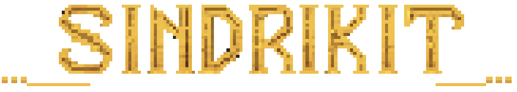

<p align="center">
  
</p>

<h1 align="center">SindriKit</h1>

<p align="center">
  <strong>Offensive Development Deserves Better Architecture.</strong><br>
  <em>A C library for building offensive capabilities.</em>
</p>

---

## Core Concept

Most offensive utilities hardcode their execution mechanics inside the technique's logic. A reflective loader doesn't just map an image; it maps it using a specific, hardcoded chain of `VirtualAlloc` or native NTAPI calls. When an EDR starts monitoring that specific chain, you are forced to rewrite the entire tool.

SindriKit solves this by enforcing a separation of concerns via interface abstraction tables:

1. **The Technique Logic:** (e.g., loaders, injections, patchers) deals with state tracking and data orchestration. It has no knowledge of how memory is allocated or how threads are created.
2. **The Execution Mechanics:** (e.g., Win32 API, Native NTAPI, Direct Syscalls) are inside independent API tables and injected into the technique at runtime.

By shifting execution mechanics to runtime function pointers, you can swap your entire strategy from Win32 calls to raw direct syscalls with a single line of code—without changing your payload execution logic.

---

## Design Architecture

* **Decoupled Execution Profiles:** Swap underlying memory, module, and thread manipulation behaviors via function pointer tables without breaking the calling technique.
* **Cascading Syscall Fallbacks:** Pluggable SSN resolvers (`snd_syscall_resolve_ssn_scan`, `snd_syscall_resolve_ssn_sort`) with a priority chain — swap or extend strategies without touching domain code.
* **Compile-Time Obfuscation:** String and API hashing algorithms (DJB2, FNV1A) can be swapped globally via CMake. Compiling automatically randomizes the global seed to alter static signatures.
* **Release Builds:** A silent tier strips all diagnostic strings, file descriptors, and tracking frames from the final binary, reducing your static footprint to bare primitives.

---

## Integrating SindriKit

```cmake
cmake_minimum_required(VERSION 3.16)
project(MyTool C ASM_MASM)

set(SND_BUILD_PAYLOADS  OFF    CACHE BOOL   "")
set(SND_ENABLE_DEBUG    OFF    CACHE BOOL   "")
set(SND_HASH_ALGO      "DJB2"  CACHE STRING "")
set(SND_RANDOMIZE_SEED  ON     CACHE BOOL   "")

add_subdirectory(libs/SindriKit)

add_executable(my_tool src/main.c)
target_link_libraries(my_tool PRIVATE sindri::engine)
```

```sh
cmake -B build && cmake --build build --config Release
```

Just two lines for your tool to inherit all of SindriKit's capabilities: PE parsing, syscall resolution, reflective loading...

---

## The Engine

### API Abstraction Layer

```
        ┌────────────────────────────────────────────────────────────────────────────┐
        │                          ANY OFFENSIVE INTENT                              │
        │    Loader · Injector · Spoofer · Patcher · Bypasser · Harvester · ...      │
        ├────────────────────────────────────────────────────────────────────────────┤
        │                     SINDRIKIT API ABSTRACTION LAYER                        │
        │      snd_memory_api_t  ->  alloc · free · protect                          │
        │      snd_module_api_t  ->  load_library · get_proc_address · ...           │
        │      snd_process_api_t ->  open · alloc_remote · write · protect · thread  │
        │      [ future tables ] ->  thread · object · ...                           │
        ├──────────────────┬──────────────────────┬──────────────────────────────────┤
        │   Win32 Profile  │    Native Profile    │    Bring Your Own Mechanic       │
        │  VirtualAlloc    │  NtAllocateVirtual   │  Driver · ROP · Exotic           │
        │  LoadLibraryA    │  PEB Walk + EAT      │  Operator-defined functions      │
        └──────────────────┴──────────────────────┴──────────────────────────────────┘
```

In practice, this means every domain follows the same contract:

```c
// Reflective loader
snd_ldr_pe_ctx_t ctx = {0};
ctx.raw_source = &payload;
ctx.mem_api    = &snd_mem_win;   // or snd_mem_nt / snd_mem_sys
ctx.mod_api    = &snd_mod_win;   // or snd_mod_nt
snd_ldr_pe_prepare_image(&ctx);
snd_ldr_pe_execute_image(&ctx);

// Classic injection
snd_inj_ctx_t inj = {0};
inj.target_pid = 1337;
inj.payload    = &shellcode;
inj.proc_api   = &snd_proc_sys;  // or snd_proc_win / snd_proc_nt
snd_inj_classic_shell(&inj);
snd_inj_cleanup(&inj);
```

### Cascading Syscall Pipeline

SindriKit treats syscall resolution as an injectable mechanic, stacking strategies in priority order. The engine falls through until one succeeds:

```c
snd_syscall_set_ntdll(clean_ntdll);
snd_syscall_set_resolver(snd_syscall_resolve_ssn_scan);
snd_syscall_add_resolver(snd_syscall_resolve_ssn_sort);
snd_syscall_set_invoker(snd_syscall_direct_invoke_asm);
// or for indirect syscalls:
// snd_syscall_set_invoker(snd_syscall_indirect_invoke_asm);
// snd_syscall_set_gadget_finder(snd_syscall_find_gadget_scan);
```

The invoker is decoupled from SSN resolution — switch between direct and indirect syscalls without modifying domain code. Indirect invocation jumps to a legitimate NTDLL gadget, keeping the syscall return address within `ntdll.dll`.

### Compile-Time Algorithm Agility

Every API name and module string is removed from the final binary at compile time via a single CMake variable:

```cmake
set(SND_HASH_ALGO "FNV1A")  # or DJB2 recomputes everything automatically
set(SND_RANDOMIZE_SEED ON)  # generates a fresh 32-bit seed on next configure
```

Each hash is computed with a randomly generated seed (if `SND_RANDOMIZE_SEED=ON`). Static footprint shifts completely between compilations without touching a line of C.

### Architecture-Aware Dynamic FFI

A custom MASM assembly bridge for arbitrary runtime function invocation. x64 builds follow the Microsoft x64 calling convention precisely (shadow space, register argument placement, stack alignment). x86 builds push arguments in reverse order with support for both `cdecl` and `stdcall` targets.

### Bounds-Checked PE Parser

A unified PE32/PE32+ parser with an `is_mapped` flag that correctly handles both raw on-disk images and memory-mapped views. Every data directory access is validated against tracked buffer bounds before dereferencing. Export resolution supports forwarder chains up to depth 4 with hash-based lookup.

Tested against:
- 40+ core test combinations targeting edge-case EXEs, DLLs, bad arguments, missing exports, and TLS callbacks across x86 and x64.
- 100+ dynamic PE mutations generated by the `pe_mutator` module: zeroed section names, integer overflows, invalid `e_lfanew` bounds, mangled imports.
- Full Corkami corpus: cleanly loads valid samples, cleanly rejects malformed ones without crashing across 99% of the samples.

### State-Tracked Domain Contexts

Every offensive operation is managed through a discrete context structure with stage enumeration. Operations can be paused between stages for sleep obfuscation or staged deployment, resumed cleanly, and inspected for the exact failure point down to the subsystem and reason.

---

## The API Design Philosophy

Bootstrap the syscall pipeline once (typical pattern):

```c
PVOID clean_ntdll = NULL;
snd_om_knowndll_map(&snd_map_nt, L"ntdll.dll", &clean_ntdll);
snd_syscall_set_ntdll(clean_ntdll);
snd_syscall_set_resolver(snd_syscall_resolve_ssn_scan);
snd_syscall_add_resolver(snd_syscall_resolve_ssn_sort);
snd_syscall_set_invoker(snd_syscall_direct_invoke_asm);
// or for indirect syscalls:
// snd_syscall_set_invoker(snd_syscall_indirect_invoke_asm);
// snd_syscall_set_gadget_finder(snd_syscall_find_gadget_scan);
```

The invoker is decoupled from SSN resolution — switch between direct and indirect syscalls without modifying domain code. Indirect invocation jumps to a legitimate NTDLL gadget, keeping the syscall return address within `ntdll.dll`.

Swap execution profile with one assignment:

```c
ctx.mem_api = &snd_mem_win;   // diagnostic
ctx.mem_api = &snd_mem_nt;    // NT stubs via PEB + EAT
ctx.mem_api = &snd_mem_sys;   // direct syscalls (pipeline required)
```

Module resolution follows the same pattern (`snd_mod_win` vs `snd_mod_nt`). There is no syscall-backed module backend — imports use PEB walk + EAT even in full `_sys` profiles.

---

## Build Tiers

### Debug Tier — `SND_ENABLE_DEBUG=ON`

For local development. `snd_status_t` expands to include `file`, `line`, and a 128-byte `context` string buffer. `SND_ERR_CTX` and `SND_DEBUG_PRINT` emit state machine transitions, parsed PE field values, and syscall resolution outcomes. Use `SND_USE_PRINTF=ON` to route output to `stdout` instead of the debug console.

### Silent Tier — `SND_ENABLE_DEBUG=OFF`

The standard deployment configuration for operational binaries. Every diagnostic string, file reference, and line number compiles away completely. `snd_status_t` collapses to two integers. Nothing else.

```cmake
set(SND_ENABLE_DEBUG   OFF   CACHE BOOL   "")
set(SND_BUILD_PAYLOADS OFF   CACHE BOOL   "")
set(SND_RANDOMIZE_SEED ON    CACHE BOOL   "")
set(SND_USE_DEFAULTS   ON    CACHE BOOL   "")
set(SND_HASH_ALGO    "DJB2"  CACHE STRING "")
add_subdirectory(vendor/SindriKit)
target_link_libraries(my_tool PRIVATE sindri::engine)
```

---

## Documentation

Full reference under [`docs/`](docs/README.md):

- **[Getting Started](docs/getting_started/)** — CMake, build tiers, DI bootstrap, first loader/injection workflow
- **[Architecture](docs/architecture/)** — Dependency injection, state machines, status system
- **[Primitives](docs/domains/primitives/)** — Memory, modules, process, mapping, syscalls, execution (FFI)
- **[Loaders](docs/domains/loaders/)** — Reflective PE pipeline
- **[Injection](docs/domains/injection/)** — Classic shellcode and PE injection
- **[Parsers](docs/parsers/)** — PE and env (PEB) subdomains
- **[Common](docs/common/)** — CRT-free helpers, buffers, hashing, status
- **[Examples & PoCs](docs/examples/)** — `loader_winapi`, `loader_nowinapi`, `inject_pe`, `inject_shell`, `heavens_gate`
- **[Tests](docs/tests/)** — Integration runner, PE mutator

*Planned: **[Evasion](docs/domains/evasion/)** domain.*

---

## Disclaimer

**SindriKit is built for educational, research, and authorized Red Teaming purposes only.** For the full legal disclaimer and information regarding OpSec considerations, see the [Security Policy](SECURITY.md).

---

## Support the Project

SindriKit is open-source and built for the community. If this framework saved you development time or assisted in your research, consider supporting independent offensive R&D:

* **BTC:** `bc1qsm7dsdsqmlwcw3f7uarxgx0mlu8tlxnyd7y2gz`

---

## License

[MIT](LICENSE)

---

<p align="center">
  
</p>
