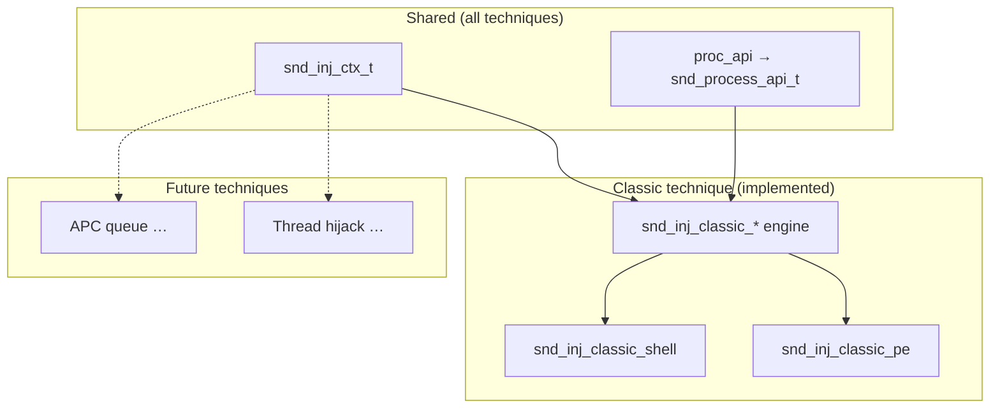

# Injection Techniques

Injection operations follow the same Dependency Injection and state machine patterns used throughout SindriKit. Every technique advances a shared `snd_inj_ctx_t` through discrete stages and delegates all cross-process work to `ctx->proc_api`.

**Prerequisite reading:** [Process primitives](../primitives/process/techniques.md), [Dependency Injection](../../architecture/dependency_injection.md)

---

## Architecture: One Context, Many Techniques



Future techniques will add their own engine headers (e.g. `injection/apc/engine.h`) but continue to mutate the same `snd_inj_ctx_t`. Technique-specific metadata, if ever needed, lives in technique-local structures passed alongside the shared context — not in a forked injection context type.

---

## Shared Stage Machine (`snd_inj_stage_t`)

| Stage | Set by | Meaning |
|---|---|---|
| `SND_INJ_STAGE_UNINITIALIZED` | — | Context created, not started |
| `SND_INJ_STAGE_TARGET_ACQUIRED` | `snd_inj_classic_open_target` | Handle to target process |
| `SND_INJ_STAGE_MEMORY_ALLOCATED` | `snd_inj_classic_alloc_remote` | RW region reserved in remote process |
| `SND_INJ_STAGE_PAYLOAD_WRITTEN` | `snd_inj_classic_write_payload` | Payload bytes copied remotely |
| `SND_INJ_STAGE_PROTECTIONS_SET` | `snd_inj_classic_set_protections` | Remote region transitioned to RX |
| `SND_INJ_STAGE_EXECUTED` | `snd_inj_classic_execute` | Remote thread created |

Each engine function validates the current stage and returns `SND_STATUS_INVALID_STAGE_SEQUENCE` on mismatch. This ordering is enforced for all classic paths and will be reused by future techniques that build on the same remote write/execute primitives.

---

## Classic Technique: Shellcode (`snd_inj_classic_shell`)

The baseline **Alloc → Write → Protect → Execute** pattern. The payload buffer is treated as opaque shellcode — the thread starts at `remote_base` (allocation base), not at an PE entry point.

### Pipeline

1. **Open target** — `proc_api->open_process(target_pid, PROCESS_ALL_ACCESS, …)`
2. **Allocate remote** — `payload->size` bytes, `MEM_COMMIT | MEM_RESERVE`, `PAGE_READWRITE`
3. **Write payload** — `proc_api->write_remote` copies the full shellcode buffer
4. **Protect** — single `proc_api->protect_remote` call: `PAGE_READWRITE` → `PAGE_EXECUTE_READ` over the entire allocation
5. **Execute** — `proc_api->create_remote_thread` at `remote_entry_point` (or `remote_base` if NULL), parameter `NULL`

### OpSec notes

- Avoids allocating `PAGE_EXECUTE_READWRITE` directly (RW then RX is a common evasion pattern).
- The shellcode path does not parse PE structures or touch the loader domain.
- Backend choice (`snd_proc_win` / `_nt` / `_sys`) determines telemetry surface — see [process primitives](../primitives/process/techniques.md).

### Example (`pocs/inject_shell/main.c`)

```c
snd_inj_ctx_t inj_ctx = {0};
inj_ctx.target_pid = target_pid;
inj_ctx.payload    = &shellcode_buf;
inj_ctx.proc_api   = &snd_proc_win;  // or snd_proc_sys after syscall bootstrap

snd_status_t status = snd_inj_classic_shell(&inj_ctx);
snd_inj_cleanup(&inj_ctx);
```

---

## Classic Technique: PE (`snd_inj_classic_pe`)

High-level orchestrator linking a **reflective loader context** (`snd_ldr_pe_ctx_t`) with the **shared injection context** (`snd_inj_ctx_t`). The PE is parsed, mapped, relocated, and import-fixed **locally**, then the fixed image bytes are written into the remote process. Execution starts at the remote entry point (`remote_base + AddressOfEntryPoint`).

This is not a full in-remote reflective load — fixups happen in local memory using the loader engine, then the baked image is marshaled cross-process.

### Interleaved pipeline

The PE chain deliberately interleaves loader and injection stages so relocations use the **remote base** as the execution address:

| Step | Component | Action |
|---|---|---|
| 1 | Loader | `snd_pe_parse(ldr_ctx->raw_source, FALSE, &ldr_ctx->pe)` → `SND_STAGE_PARSED` |
| 2 | Loader | `snd_ldr_pe_compatibility_check` |
| 3 | Loader | `snd_ldr_pe_allocate_and_copy_image` — local RW mapping |
| 4 | Injection | `inj_ctx->payload` ← local mapped buffer (`local_base`, `allocated_size`) |
| 5 | Injection | `snd_inj_classic_open_target` |
| 6 | Injection | `snd_inj_classic_alloc_remote` — remote RW region sized to `allocated_size` |
| 7 | Loader | `ldr_ctx->target.execution_base = inj_ctx->remote_base` |
| 8 | Loader | `snd_ldr_pe_apply_relocations` — delta = remote_base − ImageBase |
| 9 | Loader | `snd_ldr_pe_resolve_imports` — IAT patched locally |
| 10 | Injection | `snd_inj_classic_write_payload` — writes baked image to remote |
| 11 | Injection | `snd_inj_classic_set_protections` — flat `PAGE_EXECUTE_READ` on remote region |
| 12 | Injection | `remote_entry_point = remote_base + ep_rva`; `snd_inj_classic_execute` |

**Key behaviors:**

- **`execution_base`** on the loader context is set to the remote allocation address *before* relocations so the delta matches where the image will run.
- **Per-section protections** (`snd_ldr_pe_apply_memory_protections`) are **not** called — the injection path applies a single RX protection over the entire remote allocation.
- **TLS callbacks** are **not** invoked in the current PE injection chain.
- **Local execution** (`snd_ldr_pe_execute_image`) is blocked when `local_base != execution_base`; detach/free similarly refuse remote-prepared images.

For DLL payloads, the remote thread starts at `AddressOfEntryPoint` (the DLL entry symbol, typically `DllMain`) with **`NULL` thread parameter** — not a typed `DllMain(hinst, DLL_PROCESS_ATTACH, NULL)` call. Do not assume `DLL_PROCESS_ATTACH` semantics; this differs from local `snd_ldr_pe_execute_image` in `chain.c`.

### Example (`pocs/inject_pe/main.c`)

```c
snd_ldr_pe_ctx_t ldr_ctx = {0};
snd_inj_ctx_t    inj_ctx = {0};

ldr_ctx.mem_api    = &snd_mem_sys;
ldr_ctx.mod_api    = &snd_mod_nt;
ldr_ctx.raw_source = &file_buf;

inj_ctx.target_pid = target_pid;
inj_ctx.proc_api   = &snd_proc_sys;

snd_status_t status = snd_inj_classic_pe(&ldr_ctx, &inj_ctx);
snd_inj_cleanup(&inj_ctx);
```

---

## Cleanup

`snd_inj_cleanup` closes `remote_thread` and `target_process` via `proc_api->close_handle`, clears remote fields, and resets stage to `UNINITIALIZED`. It does not free the local loader mapping — callers manage `snd_ldr_pe_free_mapped_image` separately if a local `snd_ldr_pe_ctx_t` was used.

---

## Planned Techniques

Future injection techniques will reuse `snd_inj_ctx_t` and `proc_api`:

| Technique | Description |
|---|---|
| **APC queue** | Queue user APC to an alertable thread via `NtQueueApcThread` |
| **Thread hijack** | Suspend thread, rewrite context, resume |
| **Process hollowing** | Replace remote image in situ (loader + injection coordination) |

Each will add technique-specific engine headers under `include/sindri/injection/<technique>/` without forking the shared context type.
