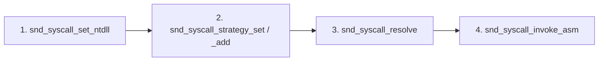

# Syscall Execution Pipeline

EDRs hook `ntdll.dll` syscall stubs in userland. Direct syscalls skip those stubs: the operator resolves the System Service Number (SSN) for a target `Nt*` function and invokes `syscall` with that number.

SSNs vary across Windows builds. SindriKit resolves them dynamically at runtime against a caller-supplied `ntdll` image.

---

## Lifecycle



### 1. Provide `ntdll` base

Register the image used for SSN extraction:

```c
snd_syscall_set_ntdll(ntdll_base);
```

| Source | Trade-off |
|---|---|
| PEB-resident `ntdll` | No I/O; may reflect hooked stubs (scan falls back to neighbor search) |
| KnownDlls map | Clean text section; recommended for `_sys` backends |
| Disk load | Simple; file read telemetry |

See [mapping techniques](../mapping/techniques.md) for KnownDlls bootstrap.

### 2. Configure strategy chain

```c
snd_syscall_strategy_set(snd_syscall_resolve_ssn_scan);   // primary
snd_syscall_strategy_add(snd_syscall_resolve_ssn_sort);   // fallback
```

`snd_syscall_strategy_set` **replaces** the entire chain. Each `snd_syscall_strategy_add` appends up to 3 fallbacks (4 total).

### 3. Resolve SSN

```c
snd_syscall_entry_t entry = {0};
snd_status_t status = snd_syscall_resolve(SND_HASH_NTOPENSECTION, &entry);
```

`snd_syscall_resolve` tries each registered strategy in order until one returns `SND_OK`.

### 4. Invoke

Populate `snd_syscall_args_t` and call the ASM stub:

```c
snd_syscall_args_t args = {0};
args.ssn  = entry.wSystemCall;
args.arg1 = ...;
// arg2–arg11 as required by the target syscall

NTSTATUS nt_status = snd_syscall_invoke_asm(&args);
```

`_sys` primitive implementations (`snd_mem_sys`, `snd_proc_sys`, `snd_map_sys`) wrap steps 3–4 internally — operators only bootstrap once at startup.

---

## Full example

```c
// Bootstrap (once per process)
PVOID ntdll = NULL;
snd_status_t st = snd_om_knowndll_map(&snd_map_nt, L"ntdll.dll", &ntdll);
if (SND_FAILED(st)) return st;

snd_syscall_set_ntdll(ntdll);
snd_syscall_strategy_set(snd_syscall_resolve_ssn_scan);
snd_syscall_strategy_add(snd_syscall_resolve_ssn_sort);

// Resolve + invoke NtClose
snd_syscall_entry_t entry = {0};
st = snd_syscall_resolve(SND_HASH_NTCLOSE, &entry);
if (SND_FAILED(st)) return st;

snd_syscall_args_t args = {0};
args.ssn  = entry.wSystemCall;
args.arg1 = handle;

NTSTATUS nt = snd_syscall_invoke_asm(&args);
```

---

## Integration with `_sys` backends

After bootstrap, swapping to syscall-backed primitives requires no additional setup:

```c
ctx.mem_api  = &snd_mem_sys;
inj_ctx.proc_api = &snd_proc_sys;
```

Each `_sys` API function calls `snd_syscall_resolve` with the appropriate hash, packs arguments into `snd_syscall_args_t`, and invokes `snd_syscall_invoke_asm`.

---

## Failure modes

| Status | Cause |
|---|---|
| `SND_STATUS_NOT_INITIALIZED` | `snd_syscall_set_ntdll` not called, or no strategies registered |
| `SND_STATUS_SSN_NOT_FOUND` | All strategies failed for the hash |
| `SND_STATUS_BUFFER_TOO_SMALL` | Strategy chain full (max 4) |
| `SND_STATUS_INVALID_PARAMETER` | NULL resolver passed to `strategy_add` |

---

## See also

- [Resolver engines](engines.md) — scan vs sort internals
- [API reference](api_reference.md)
