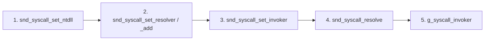

# Syscall Execution Pipeline

EDRs hook `ntdll.dll` syscall stubs in userland. Direct syscalls skip those stubs: the operator resolves the System Service Number (SSN) for a target `Nt*` function and invokes `syscall` with that number. SindriKit supports both direct and indirect syscall invocation. Direct syscalls execute the `syscall` instruction inline, while indirect syscalls jump to a legitimate gadget within NTDLL to evade EDR call-stack analysis.

SSNs vary across Windows builds. SindriKit resolves them dynamically at runtime against a caller-supplied `ntdll` image.

---

## Lifecycle



### 1. Provide `ntdll` base

Register the image used for SSN extraction:

```c
snd_syscall_set_ntdll(ntdll_base);
```

| Source | Trade-off |
|---|---|
| PEB-resident `ntdll` | No I/O; may reflect hooked stubs (scan falls back to neighbor search) |
| KnownDlls map | Clean text section; recommended for `_sys` backends |
| Disk load | Simple; file read telemetry |

See [mapping techniques](../mapping/techniques.md) for KnownDlls bootstrap.

### 2. Configure strategy chain

```c
snd_syscall_set_resolver(snd_syscall_resolve_ssn_scan);
snd_syscall_add_resolver(snd_syscall_resolve_ssn_sort);
snd_syscall_set_invoker(snd_syscall_direct_invoke_asm);
// or for indirect syscalls:
// snd_syscall_set_invoker(snd_syscall_indirect_invoke_asm);
// snd_syscall_set_gadget_finder(snd_syscall_find_gadget_scan);
```

`snd_syscall_set_resolver` **replaces** the entire chain. Each `snd_syscall_add_resolver` appends up to 3 fallbacks (4 total).

### 3. Configure invoker

```c
snd_syscall_set_invoker(snd_syscall_direct_invoke_asm);     // direct
// or
snd_syscall_set_invoker(snd_syscall_indirect_invoke_asm);   // indirect
snd_syscall_set_gadget_finder(snd_syscall_find_gadget_scan); // required for indirect
```

Indirect invocation requires a gadget finder. `snd_syscall_find_gadget_scan` resolves the target function in the natively loaded NTDLL via PEB and scans for a `syscall; ret` gadget (x64) or the transition stub entry (x86).

### 4. Resolve SSN

```c
snd_syscall_entry_t entry = {0};
snd_status_t status = snd_syscall_resolve(SND_HASH_NTOPENSECTION, &entry);
```

`snd_syscall_resolve` tries each registered strategy in order until one returns `SND_OK`.

### 5. Invoke

Populate `snd_syscall_args_t` and call via the global invoker:

```c
snd_syscall_args_t args = {0};
args.ssn      = entry.wSystemCall;
args.sys_addr = entry.pSyscallAddr;
args.arg1     = ...;
// arg2–arg11 as required by the target syscall

NTSTATUS nt_status = g_syscall_invoker(&args);
```

`sys_addr` is only used by the indirect invoker; the direct invoker ignores it.

`_sys` primitive implementations (`snd_mem_sys`, `snd_proc_sys`, `snd_map_sys`) wrap steps 4–5 internally — operators only bootstrap once at startup.

---

## Full example

```c
// Bootstrap (once per process)
PVOID ntdll = NULL;
snd_status_t st = snd_om_knowndll_map(&snd_map_nt, L"ntdll.dll", &ntdll);
if (SND_FAILED(st)) return st;

snd_syscall_set_ntdll(ntdll);
snd_syscall_set_resolver(snd_syscall_resolve_ssn_scan);
snd_syscall_add_resolver(snd_syscall_resolve_ssn_sort);
snd_syscall_set_invoker(snd_syscall_direct_invoke_asm);
// or for indirect syscalls:
// snd_syscall_set_invoker(snd_syscall_indirect_invoke_asm);
// snd_syscall_set_gadget_finder(snd_syscall_find_gadget_scan);

// Resolve + invoke NtClose
snd_syscall_entry_t entry = {0};
st = snd_syscall_resolve(SND_HASH_NTCLOSE, &entry);
if (SND_FAILED(st)) return st;

snd_syscall_args_t args = {0};
args.ssn      = entry.wSystemCall;
args.sys_addr = entry.pSyscallAddr;
args.arg1     = handle;

NTSTATUS nt = g_syscall_invoker(&args);
```

---

## `SND_USE_DEFAULTS`

When enabled, all globals (invoker, gadget finder, primary resolver) are pre-configured. The only required bootstrap call is `snd_syscall_set_ntdll()`.

> [!TIP]
> **OpSec Rationale:** Why use a compile-time macro instead of just initializing the variables to default pointers in `syscalls.c`? 
> If the variables were unconditionally initialized with pointers to `snd_syscall_indirect_invoke_asm` and `snd_syscall_find_gadget_scan`, the C linker would be forced to pull those entire functions (including the scanner logic and ASM stubs) into the final compiled binary, even if the user explicitly chose to use direct syscalls or no syscalls at all. 
> By using `SND_USE_DEFAULTS`, we ensure the default dependency graph is completely severed when disabled, keeping the payload footprint as lean and evasive as possible.

---

## Integration with `_sys` backends

After bootstrap, swapping to syscall-backed primitives requires no additional setup:

```c
ctx.mem_api  = &snd_mem_sys;
inj_ctx.proc_api = &snd_proc_sys;
```

Each `_sys` API function calls `snd_syscall_resolve` with the appropriate hash, packs arguments into `snd_syscall_args_t`, and invokes `g_syscall_invoker`.

---

## Failure modes

| Status | Cause |
|---|---|
| `SND_STATUS_NOT_INITIALIZED` | `snd_syscall_set_ntdll` not called, invoker not set, or no strategies registered |
| `SND_STATUS_SSN_NOT_FOUND` | All strategies failed for the hash |
| `SND_STATUS_PIPELINE_EXHAUSTED` | Strategy chain full (max 4) |
| `SND_STATUS_NULL_POINTER` | NULL resolver passed to `strategy_add` |

---

## See also

- [Resolver engines](engines.md) — scan vs sort internals
- [API reference](api_reference.md)
