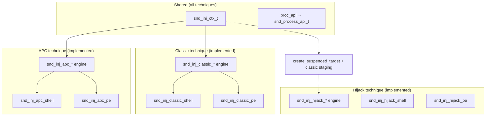

# Injection Techniques

Injection operations follow the same Dependency Injection and state machine patterns used throughout SindriKit. Every technique advances a shared `snd_inj_ctx_t` through discrete stages and delegates all cross-process work to `ctx->proc_api`.

**Prerequisite reading:** [Process primitives](../primitives/process/internals.md), [Dependency Injection](../architecture/dependency_injection.md)

---

## Architecture: One Context, Many Techniques



Future techniques will add their own engine headers (e.g. `injection/hollowing/engine.h`) but continue to mutate the same `snd_inj_ctx_t`. Technique-specific metadata, if ever needed, lives in technique-local structures passed alongside the shared context — not in a forked injection context type.

---

## Shared Stage Machine (`snd_inj_stage_t`)

| Stage | Set by | Meaning |
|---|---|---|
| `SND_INJ_STAGE_UNINITIALIZED` | — | Context created, not started |
| `SND_INJ_STAGE_TARGET_ACQUIRED` | `snd_inj_open_target` / `snd_inj_create_suspended_target` | Handle to target process / suspended process created |
| `SND_INJ_STAGE_MEMORY_ALLOCATED` | `snd_inj_alloc_remote` / `snd_inj_alloc_remote_size` | RW region reserved in remote process |
| `SND_INJ_STAGE_PAYLOAD_WRITTEN` | `snd_inj_write_payload` | Payload bytes copied remotely |
| `SND_INJ_STAGE_PROTECTIONS_SET` | `snd_inj_set_protections` | Remote region transitioned to RX |
| `SND_INJ_STAGE_CONTEXT_APPLIED` | `snd_inj_hijack_execute` | Thread context rewritten; resume is still pending |
| `SND_INJ_STAGE_EXECUTED` | `snd_inj_classic_execute` / `snd_inj_apc_execute` / `snd_inj_hijack_execute` | Remote thread created / APC queued and thread resumed / initial thread resumed with rewritten context |

Each engine function validates the current stage and returns `SND_STATUS_INVALID_STAGE` on mismatch. This ordering is enforced for all classic, APC, and hijack paths and will be reused by future techniques that build on the same remote write/execute primitives.

---

## Classic Technique: Shellcode (`snd_inj_classic_shell`)

The baseline **Alloc → Write → Protect → Execute** pattern. The payload buffer is treated as opaque shellcode — the thread starts at `remote_base` (allocation base), not at an PE entry point.

### Pipeline

1. **Open target** — `proc_api->open_process(target_pid, PROCESS_ALL_ACCESS, …)`
2. **Allocate remote** — `payload->size` bytes, `MEM_COMMIT | MEM_RESERVE`, `PAGE_READWRITE`
3. **Write payload** — `proc_api->write_remote` copies the full shellcode buffer
4. **Protect** — single `proc_api->protect_remote` call: `PAGE_READWRITE` → `PAGE_EXECUTE_READ` over the entire allocation
5. **Execute** — `proc_api->create_remote_thread` at `remote_entry_point` (or `remote_base` if NULL), parameter `NULL`

### OpSec notes

- Avoids allocating `PAGE_EXECUTE_READWRITE` directly (RW then RX is a common evasion pattern).
- The shellcode path does not parse PE structures or touch the loader domain.
- Backend choice (`snd_proc_win` / `_nt` / `_sys`) determines telemetry surface — see [process primitives](../primitives/process/internals.md).

### Example (`pocs/src/cmd_inject_classic.c`, invoked as `unified inject classic`)

```c
snd_inj_ctx_t inj_ctx = {0};
inj_ctx.target_pid = target_pid;
inj_ctx.payload    = &shellcode_buf;
inj_ctx.proc_api   = &snd_proc_win;  // or snd_proc_sys after syscall bootstrap

snd_status_t status = snd_inj_classic_shell(&inj_ctx);
snd_inj_cleanup(&inj_ctx);
```

---

## Classic Technique: PE (`snd_inj_classic_pe`)

High-level orchestrator linking a **reflective loader context** (`snd_ldr_pe_ctx_t`) with the **shared injection context** (`snd_inj_ctx_t`). The PE is parsed, mapped, relocated, and import-fixed **locally**, then the fixed image bytes are written into the remote process. Execution starts at the remote entry point (`remote_base + AddressOfEntryPoint`).

This is not a full in-remote reflective load — fixups happen in local memory using the loader engine, then the baked image is marshaled cross-process.

### Interleaved pipeline

The PE chain deliberately interleaves loader and injection stages so relocations use the **remote base** as the execution address:

| Step | Component | Action |
|---|---|---|
| 1 | Loader | `snd_pe_parse(ldr_ctx->raw_source, FALSE, &ldr_ctx->pe)` → `SND_STAGE_PARSED` |
| 2 | Loader | Inline `SND_IS_ARCH_COMPATIBLE` guard in `snd_ldr_pe_prepare_image` (`SND_STATUS_ARCH_MISMATCH` on mismatch) |
| 3 | Loader | `snd_ldr_pe_allocate_and_copy_image` — local RW mapping |
| 4 | Injection | `inj_ctx->payload` <- local mapped buffer (`local_base`, `allocated_size`) |
| 5 | Injection | `snd_inj_open_target` |
| 6 | Injection | `snd_inj_alloc_remote` — remote RW region sized to `allocated_size` |
| 7 | Loader | `ldr_ctx->target.execution_base = inj_ctx->remote_base` |
| 8 | Loader | `snd_ldr_pe_apply_relocations` — delta = remote_base − ImageBase |
| 9 | Loader | `snd_ldr_pe_resolve_imports` — IAT patched locally |
| 10 | Injection | `snd_inj_write_payload` — writes baked image to remote |
| 11 | Injection | `snd_inj_set_protections` — flat `PAGE_EXECUTE_READ` on remote region |
| 12 | Injection | `remote_entry_point = remote_base + ep_rva`; `snd_inj_classic_execute` |

**Key behaviors:**

- **`execution_base`** on the loader context is set to the remote allocation address *before* relocations so the delta matches where the image will run.
- **Per-section protections** (`snd_ldr_pe_apply_memory_protections`) are **not** called — the injection path applies a single RX protection over the entire remote allocation.
- **TLS callbacks** are **not** invoked in the current PE injection chain.
- **Local execution** (`snd_ldr_pe_execute_image`) is blocked when `local_base != execution_base`; detach/free similarly refuse remote-prepared images.

For DLL payloads, the remote thread starts at `AddressOfEntryPoint` (the DLL entry symbol, typically `DllMain`) with **`NULL` thread parameter** — not a typed `DllMain(hinst, DLL_PROCESS_ATTACH, NULL)` call. Do not assume `DLL_PROCESS_ATTACH` semantics; this differs from local `snd_ldr_pe_execute_image` in `chain.c`.

### Example (`pocs/src/cmd_inject_classic.c`, invoked as `unified inject classic`)

```c
snd_ldr_pe_ctx_t ldr_ctx = {0};
snd_inj_ctx_t    inj_ctx = {0};

ldr_ctx.mem_api    = &snd_mem_sys;
ldr_ctx.mod_api    = &snd_mod_nt;
ldr_ctx.raw_source = &file_buf;

inj_ctx.target_pid = target_pid;
inj_ctx.proc_api   = &snd_proc_sys;

snd_status_t status = snd_inj_classic_pe(&ldr_ctx, &inj_ctx);
snd_inj_cleanup(&inj_ctx);
```

---

## Classic Technique: COFF (`snd_inj_classic_coff`)

Similar to the PE classic path, this technique orchestrates a local COFF loading context (`snd_ldr_coff_ctx_t`) with the shared injection context (`snd_inj_ctx_t`). The unlinked object is parsed, memory is allocated, symbols resolved, and sections are relocated locally. The final assembled image, along with any arguments, is then copied to the remote process.

### Interleaved pipeline

The COFF chain relies on allocating a remote buffer that is large enough to hold both the fully prepared COFF sections and the packed argument buffer for the BOF.

| Step | Component | Action |
|---|---|---|
| 1 | Loader | `snd_coff_parse` → `SND_COFF_STAGE_PARSED` |
| 2 | Loader | `snd_ldr_coff_allocate_and_copy_sections` — local mapping |
| 3 | Injection | `snd_inj_open_target` |
| 4 | Injection | `snd_inj_alloc_remote_size` — remote RW sized to `allocated_size + arg_len` |
| 5 | Loader | `ldr_ctx->target.execution_base = inj_ctx->remote_base` |
| 6 | Loader | `snd_ldr_coff_resolve_symbols` |
| 7 | Loader | `snd_ldr_coff_apply_relocations` |
| 8 | Injection | `snd_inj_write_payload` — writes baked image to remote |
| 9 | Injection | Optional: write BOF arguments buffer to `remote_base + allocated_size` |
| 10 | Injection | `snd_inj_set_protections` — flat `PAGE_EXECUTE_READ` |
| 11 | Injection | Find entry point offset, calculate `remote_entry_point`, and `snd_inj_classic_execute` |

**Key behaviors:**

- **Arguments passing:** The arguments buffer is appended to the payload memory. `create_remote_thread` is invoked with `lpParameter` pointing to this remote argument buffer, adhering to the BOF argument convention `(char *args, int arg_len)`.
- **Relocations & Trampolines:** Because COFF payloads might call Windows API via `mod_api`, any absolute addresses injected during symbol resolution are automatically relocated to be accurate when the image lands in the remote memory space.

### Example (`pocs/src/cmd_inject_classic.c`, invoked as `unified inject classic`)

```c
snd_ldr_coff_ctx_t ldr_ctx = {0};
snd_inj_ctx_t      inj_ctx = {0};

ldr_ctx.mem_api    = &snd_mem_nt;
ldr_ctx.mod_api    = &snd_mod_nt;
ldr_ctx.raw_source = &file_buf;

inj_ctx.target_pid = target_pid;
inj_ctx.proc_api   = &snd_proc_nt;

snd_status_t status = snd_inj_classic_coff(&ldr_ctx, &inj_ctx, "go", bof_args, bof_arg_len);
snd_inj_cleanup(&inj_ctx);
```

---

## Cleanup

`snd_inj_cleanup` is best effort. It terminates created targets that have not
reached execution, closes the thread handle through `thread_api` when available,
releases pre-execution remote memory when `proc_api->free_remote` is available,
closes the process handle, clears remote fields, and resets stage to
`UNINITIALIZED`. It does not free the local loader mapping; callers manage
`snd_ldr_pe_free_mapped_image` or `snd_ldr_coff_free_mapped_image` separately.

---

## APC Technique: Early Bird (`snd_inj_apc_*`)

The APC technique queues an APC to an alertable thread. It is implemented via the "Early Bird" pattern: create a suspended process, queue an APC to its initial thread, then resume the thread so the APC fires.

### Pipeline

1. **Create suspended target** — `proc_api->create_process(target_image_path, NULL, &target_process, &remote_thread)`
2. **Allocate remote** — remote RW region
3. **Write payload** — `proc_api->write_remote` copies the payload
4. **Protect** — `PAGE_EXECUTE_READ` over the entire allocation
5. **Execute** — `thread_api->queue_apc` to queue the APC, then `thread_api->resume_thread` to resume the suspended thread and trigger the APC

For PE and COFF paths, the loader steps (parse, local map, relocate, resolve) are interleaved identically to the classic paths, using the same loader contexts (`snd_ldr_pe_ctx_t` or `snd_ldr_coff_ctx_t`).

> [!WARNING]
> When using `--nt` or `--sys` backends, the target process is created via `NtCreateUserProcess` without CSRSS registration. GUI-heavy targets (e.g. `notepad.exe`) will crash during subsystem initialisation. Use lightweight executables like `calc.exe` as targets, or fall back to `--win`. See [Known Limitation: CSRSS Registration](../primitives/process/internals.md#known-limitation-csrss-registration-and-gui-targets).

### Example (`pocs/src/cmd_inject_apc.c`, invoked as `unified inject apc`)

```c
snd_inj_ctx_t inj_ctx = {0};
inj_ctx.target_image_path = target_image_path;
inj_ctx.payload    = &shellcode_buf;
inj_ctx.proc_api   = &snd_proc_nt;
inj_ctx.thread_api = &snd_thread_nt;

snd_status_t status = snd_inj_apc_shell(&inj_ctx);
snd_inj_cleanup(&inj_ctx);
```

---

## Hijack Technique: Suspended-Process Context Rewrite (`snd_inj_hijack_*`)

The hijack technique spawns a suspended target process and executes the payload
by **rewriting the suspended initial thread's context** — no
`CreateRemoteThread`/`NtCreateThreadEx` and no APC. It reuses the shared
suspended-process target creation and the stabilized remote staging steps; only
the execute stage is technique-native.

### Pipeline

1. **Create suspended target** — `snd_inj_create_suspended_target`:
   `proc_api->create_process` returns a suspended initial thread in
   `ctx->remote_thread`.
2. **Allocate remote / write payload / protect** — the shared classic staging
   steps (`snd_inj_alloc_remote`, `snd_inj_write_payload`, `snd_inj_set_protections`).
3. **Capture context** — `thread_api->get_context` reads the live `ip/sp/rflags`.
4. **Paint entry frame** — `snd_inj_hijack_prepare_frame` sets `ip := entry`
   (`remote_entry_point` else `remote_base`), aligns `sp`, masks `rflags`, and
   wires arguments according to the architecture ABI. x64 uses `RCX/RDX`;
   x86 reserves a remote stack frame for the return address and arguments.
5. **Write entry frame** — x64 writes the return thunk only when one is
   selected by the return policy; x86 writes `[return_thunk, arg1, arg2]` only when a thunk or an
   argument is present. When the frame has no content the remote write is
   skipped, so `write_remote` is best-effort and only required when data must be
   written. `SND_INJ_RETURN_NONE` means the payload must not return;
   `SND_INJ_RETURN_GRACEFUL` makes the engine resolve a target-compatible
   thread-exit address.
6. **Apply + resume** — `thread_api->set_context`, then `resume_thread`
   (suspend count 1→0).

### OpSec notes

- No remote thread creation, no APC, no cross-process thread handle needed
  beyond the initial thread from `create_process`.
- `set_context` fetches the live native context first, then overwrites only the
  projected registers (`ip/sp/cx/dx/rflags`) — control/segment state such as
  `SegGs` (the TEB anchor) survives, so the resumed thread faults cleanly into
  the payload instead of crashing on entry.
- The payload entry frame is architecture-agnostic in the engine; all ABI
  knowledge (argument placement, alignment, EFLAGS) is owned by
  `internal/windows/context.h`.

### Example (`pocs/src/cmd_inject_hijack.c`, invoked as `unified inject hijack`)

```c
snd_inj_ctx_t inj_ctx = {0};
inj_ctx.target_image_path = target_image_path;
inj_ctx.payload    = &shellcode_buf;
inj_ctx.proc_api   = &snd_proc_nt;
inj_ctx.thread_api = &snd_thread_nt;
inj_ctx.return_policy = SND_INJ_RETURN_GRACEFUL;

snd_status_t status = snd_inj_hijack_shell(&inj_ctx);
snd_inj_cleanup(&inj_ctx);
```

---

## Planned Techniques

Future injection techniques will reuse `snd_inj_ctx_t` and `proc_api`:

| Technique | Description |
|---|---|
| **Process hollowing** | Replace remote image in situ (loader + injection coordination) |

Each will add technique-specific engine headers under `include/sindri/injection/<technique>/` without forking the shared context type.
